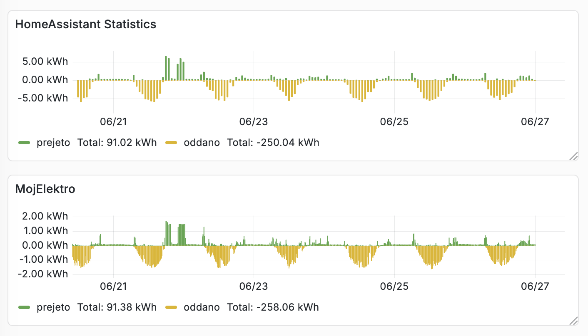
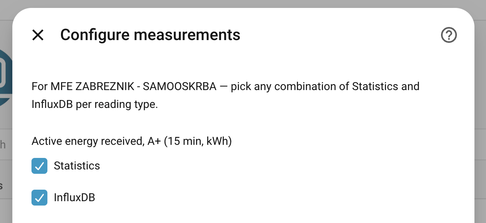
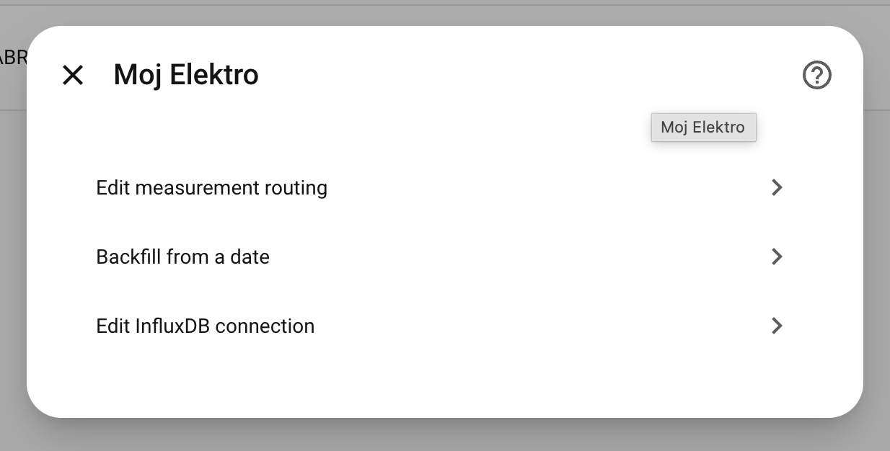

# Moj Elektro

Home Assistant integration for [Moj Elektro](https://mojelektro.si) electricity data ([API docs](https://docs.informatika.si/mojelektro/api/)). Distributed as a [HACS](https://hacs.xyz/) custom component — self-contained, no extra Python packages to install.

## What it does

- Pulls meter readings from the Moj Elektro API on a schedule
- Imports historical data into Home Assistant **Statistics** (Energy dashboard, long-term charts)
- Optionally writes raw 15-minute readings to **InfluxDB v2** for selected data points
- Backfilling data up to 2 years ago
- Support for multiple meters and accounts

<table>
  <tr>
    <td> </td>
    <td> </td>
    <td> </td>
  </tr>
</table>

Get an API token at [mojelektro.si](https://mojelektro.si) (Account → API).

## Install (HACS)

1. Add this repository as a [custom HACS repository](https://hacs.xyz/docs/faq/custom_repositories/) (category: **Integration**).
2. Install **Moj Elektro** from HACS.
3. Restart Home Assistant.
4. Add the integration via **Settings → Devices & Services → Add Integration → Moj Elektro**.

Manual install: copy `custom_components/mojelektro_stats/` into your HA `config/custom_components/` directory and restart. The integration bundles its own typed API client under `lib/` — nothing else to install.

## Repository layout

| Path | Purpose |
|------|---------|
| `custom_components/mojelektro_stats/` | **The product** — HACS integration + vendored API client |
| `cli/`, `tests/`, `scripts/`, `docker/`, `docs/` | Developer tooling — not shipped to HA users |

## Development

Contributors: see [`docs/development.md`](docs/development.md) for `uv sync`, `make test`, the local CLI, Docker dev stack, and cassette recording. AI-agent rules: [`AGENTS.md`](AGENTS.md).
